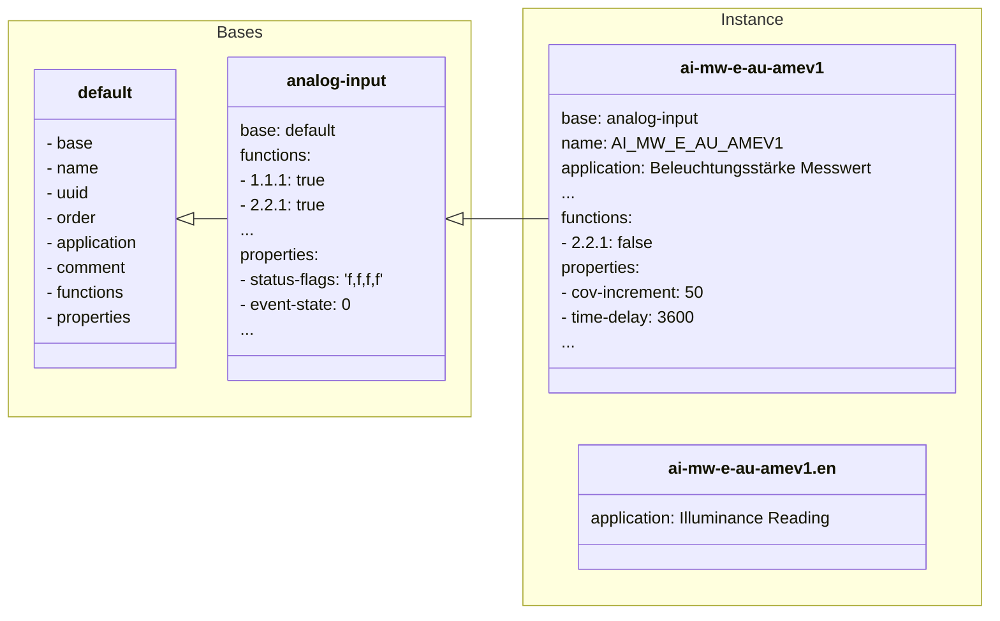

:exclamation: **Please note that this repository is currently only intended for demonstration purposes** :exclamation:

# BACtwin data

This repository provides the [AMEV BACtwin](https://www.amev-online.de/AMEVInhalt/Planen/Gebaeudeautomation/BACtwin/) data in an IT-optimized form for further automated processing.

It provides simple definitions for the AMEV BACtwin data, which can then be compiled into any other form by scripting.

Currently, the definitions are converted from a [YAML](https://yaml.org/) format into a [JSON](https://www.json.org/json-en.html) format and enhanced accordingly. In addition, there is a simple example of how this JSON data can then be converted into a [Microsoft Excel](https://www.microsoft.com/en-us/microsoft-365/excel) workbook.

For the moment, only the object templates of the object type analog input and its properties are taken into account.

# Getting Started

1. Ensure that the following programs are installed on your system in their latest, stable version.
    * [Node.js](https://nodejs.org)
    * [Git](https://git-scm.com) (recommended)
2. To try out the Excel example, you need additionally the following installations.
    * [Powershell 7+](https://docs.microsoft.com/en-us/powershell)
    * [Microsoft Excel](https://www.microsoft.com/en-us/microsoft-365/excel)
3. Create a working copy of this project if not already done.
    * With Git you can just do it by running `git clone https://github.com/daniel-evers/bactwin-data`
3. Run `npm install` inside of your working copy.
    * Run `npm run server` and open the displayed URL in your browser.
    * Run `npm run compile` to re-create the files of the `compilation` directory. (optional)
    * Run `npm run create` to create an example Excel workbook. (optional)

# How it works

The idea behind the structure of the definition is to maintain it in a simple format while avoiding as much redundancy as possible. For this purpose, the data are defined in YAML format. YAML avoids syntactic elements, such as those required for JSON and XML. Nevertheless, the documents can contain hierarchical elements and be structured accordingly. In order to support the inheritance aspects of BACtwin, the structure is designed in such a way that each instance of a definition can be derived from a base definition. In addition, it was also considered that definitions contain language-dependent elements. These can be easily adapted by localized translation files.

The following example illustrates the concept using an object template for analog inputs. The `default` base only contains the attributes that should be present. The specialized base `anlaog-input`, already reflects general parts of analog input templates.

The concrete instance `ai-mw-e-au-amev1` now simply defines the parts that differ from the bases. Finally, language-dependent parts can still be translated using localization files, as here with the `ai-mw-e-au-amev1.en` file for English.

While this structure would be adequate for IT-friendly processing, it is suboptimal for the general view by humans. For this reason, there are scripts that can compile this data structure into any desired format. Currently there are two examples of this, one for conversion to HTML and one for conversion to an Excel file. Any format and any translation is possible, without having to maintain redundant data.

# License

Unless otherwise noted, this project is licensed under the permissive [Apache 2.0](https://www.apache.org/licenses/LICENSE-2.0) license. Further information can be found in the [NOTICE](./NOTICE) file.